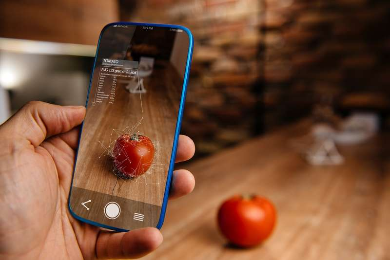

# Projektidee

## Ausgangslage
Der Trend um Ernährung ist steigend.
Es wird eine gewisse Disziplin, Wissen und Geduld benötigt um gesund und ausgewogen zu leben.
Wie schön wäre es, wenn man für sich selber ein massgeschneidertes Programm hätte, welches einem sagt, wie viel Kalorien die gegessene Mahlzeit hat und wie viel Kalorien noch zu sich für ein gesundes Leben eingenommen werden darf ?

## Funktion / Projektidee
Seit längerem befasse ich mich intensiv mit der gesunden Ernährung. Auch ist bemerkbar, dass ab einem gewissen Alter der menschliche Metabolismus (Stoffwechsel) nicht mehr wie gewohnt funktioniert. Ich habe bereits mehrere Apps getestet, welche das eigene Essverhalten beurteilen, Daten aufnehmen und auswerten.
Mit dieser Webapplikation möchte ich mein eigenes App, gekoppelt mit für mich speziell erstellten und leicht umsetzbaren Ernährungsplan entwickeln. Diese Webapplikation soll mich immer wieder aufs Neue motivieren.

## Workflow Ernährung
* Dateneingabe: Jeden Tag alle Nahrungsmittel / Mahlzeit eingeben, welche man zu sich genommen hat.
* Datenverarbeitung: Von jedem Nahrungsmittel / Mahlzeit werden die Kalorien gezählt.
* Datenausgabe: Kalorien werden zusammengezählt und ausgewertet. 

##  
